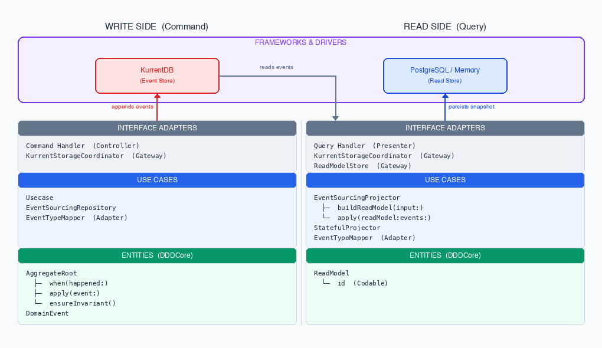

# swift-ddd-kit

**swift-ddd-kit** is a Swift framework that brings Domain-Driven Design, Event Sourcing, and CQRS to Server-Side Swift. While the Swift backend ecosystem has grown significantly, the building blocks for production-grade DDD architecture — aggregate roots, event sourcing repositories, CQRS projectors, and event migration — have remained largely absent. swift-ddd-kit fills that gap.

## Overview

This framework focuses on:

- Modeling business logic using **Aggregate Roots** as consistency boundaries
- Capturing every state change as an immutable **Domain Event**
- Replaying events to reconstruct state (**Event Sourcing**)
- Separating write and read models through **CQRS Projectors**
- Evolving event schemas safely with **Migration utilities**
- Reducing boilerplate via **SPM build-tool plugins** (YAML → Swift code generation)

## Architecture

Write and Read are fully independent — they share no direct coupling. Both reach into KurrentDB separately: the Write side appends domain events; the Read side reads those same events to build query-optimized models.



<details>
<summary>ASCII version</summary>

```
 ┌─────────────────────── FRAMEWORKS & DRIVERS ───────────────────────────────┐
 │         KurrentDB                              PostgreSQL / Memory         │
 │        (Event Store)                            (Read Store)               │
 └──────────────┬───────────────────────────────────────────────┬─────────────┘
                │ ↑ appends           reads events ↓ ───────►   │ ↑ persists
 ┌──────────────┴──────────────────────┬────────────────────────┴─────────────┐
 │     WRITE SIDE (Command)            │     READ SIDE (Query)                │
 ├─────────────────────────────────────┼──────────────────────────────────────┤
 │ INTERFACE ADAPTERS                  │ INTERFACE ADAPTERS                   │
 │   Command Handler  (Controller)     │   Query Handler  (Presenter)         │
 │   KurrentStorageCoordinator(Gateway)│   KurrentStorageCoordinator(Gateway) │
 │                                     │   ReadModelStore  (Gateway)          │
 ├─────────────────────────────────────┼──────────────────────────────────────┤
 │ USE CASES                           │ USE CASES                            │
 │   Usecase                           │   EventSourcingProjector             │
 │   EventSourcingRepository           │   ├─ buildReadModel(input:)          │
 │   EventTypeMapper  (Adapter)        │   └─ apply(readModel:events:)        │
 │                                     │   StatefulProjector                  │
 │                                     │   EventTypeMapper  (Adapter)         │
 ├─────────────────────────────────────┼──────────────────────────────────────┤
 │ ENTITIES  (DDDCore)                 │ ENTITIES  (DDDCore)                  │
 │   AggregateRoot                     │   ReadModel                          │
 │   ├─ when(happened:)                │   └─ id (Codable)                    │
 │   ├─ apply(event:)                  │                                      │
 │   └─ ensureInvariant()              │                                      │
 │   DomainEvent                       │                                      │
 └─────────────────────────────────────┴──────────────────────────────────────┘
```

</details>

> Dependency direction follows Clean Architecture: all layers depend inward toward Entities. Interface Adapters (Gateways) implement protocols defined in Use Cases/Entities — never the reverse.

## Flow

### Write Side (Command)

```
Command Handler
  │
  ├─ 1. repository.find(byId:)
  │       └─ fetches event stream from KurrentDB → replays into AggregateRoot
  │
  ├─ 2. aggregate.apply(event:)
  │       ├─ when(happened:)     mutates in-memory state
  │       ├─ ensureInvariant()   validates domain invariants
  │       └─ queues uncommitted events in AggregateRootMetadata
  │
  ├─ 3. repository.save(aggregateRoot:)
  │       └─ appends uncommitted events to KurrentDB (optimistic concurrency)
  │
  └─ 4. eventBus.postAllEvent()
          └─ publishes saved domain events to DomainEventBus subscribers
```

### Read Side (Query)

```
Query Handler
  │
  └─ StatefulEventSourcingProjector.execute(input:)
        │
        ├─ 1. store.fetch(byId:)
        │       └─ loads cached ReadModel snapshot at revision N
        │
        ├─ 2. coordinator.fetchEvents(byId:, afterRevision: N)
        │       └─ retrieves only new events from KurrentDB since last snapshot
        │
        ├─ 3. apply(readModel:events:)
        │       └─ folds new events into the ReadModel
        │
        ├─ 4. store.save(readModel:, revision:)
        │       └─ persists updated snapshot to PostgreSQL or in-memory store
        │
        └─ CQRSProjectorOutput<ReadModel>
```

## Design Principles

**Separation of Concerns** — write model (domain), read model (projection), and infrastructure (event store) are kept distinct and independently replaceable.

**Event-First Thinking** — state is never stored directly; it is always derived by replaying events. Events are the source of truth.

**Explicit Domain Modeling** — business logic lives in aggregate roots. Anemic models with external mutation are avoided by design.

## Why Swift?

- Strong type system catches event schema mismatches at compile time
- Native `async`/`await` concurrency maps cleanly onto event stream consumption
- Swift 6 strict concurrency enables safe multi-actor architectures
- A growing server-side ecosystem (SwiftNIO, Hummingbird, gRPC) makes Swift viable for production backends

## Status

This project is actively evolving. It is intended as:

- A production-capable foundation for Swift backend systems following DDD + Event Sourcing
- A reference implementation for teams exploring these patterns in Swift
- A contribution to the Swift Server ecosystem

Feedback and contributions are welcome. See open [issues](https://github.com/gradyzhuo/swift-ddd-kit/issues) for planned work.

## Requirements

- Swift 6.0+
- Ubuntu (Linux) / macOS 15+
- [KurrentDB](https://github.com/gradyzhuo/swift-kurrentdb) (for event persistence)

## Installation

Add the package to your `Package.swift`:

```swift
dependencies: [
    .package(url: "https://github.com/gradyzhuo/swift-ddd-kit.git", from: "0.1.1")
]
```

Then add `DDDKit` and `KurrentSupport` to your target:

```swift
.target(
    name: "MyTarget",
    dependencies: [
        .product(name: "DDDKit", package: "swift-ddd-kit"),
        .product(name: "KurrentSupport", package: "swift-ddd-kit"),
    ]
)
```

### Project scaffolding CLI

Looking to scaffold a runnable starter project (aggregate + use cases + KurrentDB
wiring)? That's now [swift-pangu-cli](https://github.com/gradyzhuo/swift-pangu-cli)
(`pangu project create`), a standalone tool with no dependency on this package's
library targets.

## Core Concepts

### 1. Define Domain Events

Events are the source of truth. Every state change is captured as an immutable event.

```swift
// A creation event
struct OrderCreated: DomainEvent {
    var id: UUID = .init()
    var occurred: Date = .now
    var aggregateRootId: String
    let customerId: String
}

// A deletion event
struct OrderCancelled: DeletedEvent {
    var id: UUID = .init()
    var occurred: Date = .now
    let aggregateRootId: String
}
```

### 2. Implement an Aggregate Root

The aggregate root is the consistency boundary. All state mutations go through `apply(event:)`, which calls `when(happened:)` to update in-memory state.

```swift
final class Order: AggregateRoot {
    typealias DeletedEventType = OrderCancelled

    let id: String
    private(set) var customerId: String = ""
    var metadata: AggregateRootMetadata = .init()

    init(id: String, customerId: String) throws {
        self.id = id
        try apply(event: OrderCreated(aggregateRootId: id, customerId: customerId))
    }

    required init?(events: [any DomainEvent]) throws {
        guard let first = events.first as? OrderCreated else { return nil }
        self.id = first.aggregateRootId
        try apply(events: events)
    }

    func when(happened event: some DomainEvent) throws {
        switch event {
        case let e as OrderCreated:
            customerId = e.customerId
        default:
            break
        }
    }
}
```

### 3. Implement an Event Mapper

The mapper deserializes raw KurrentDB records back into typed domain events.

```swift
struct OrderEventMapper: EventTypeMapper {
    func mapping(eventData: RecordedEvent) throws -> (any DomainEvent)? {
        switch eventData.eventType {
        case "OrderCreated":   return try eventData.decode(to: OrderCreated.self)
        case "OrderCancelled": return try eventData.decode(to: OrderCancelled.self)
        default:               return nil
        }
    }
}
```

### 4. Implement a Repository

Repositories handle persistence and retrieval through event replay.

```swift
final class OrderRepository: EventSourcingRepository {
    typealias AggregateRootType = Order
    typealias Store = KurrentStorageCoordinator<Order, CustomMetadata>

    let store: Store

    init(client: KurrentDBClient) {
        store = .init(client: client, eventMapper: OrderEventMapper())
    }
}
```

### 5. Save and Find

```swift
let client = KurrentDBClient(settings: .localhost())
let repository = OrderRepository(client: client)

// Create and save
let order = try Order(id: "order-001", customerId: "customer-42")
try await repository.save(aggregateRoot: order)

// Replay from event stream
let found = try await repository.find(byId: "order-001")

// Soft delete (marks as deleted, still retrievable with hiddingDeleted: false)
try await repository.delete(byId: "order-001")

// Hard delete (irreversible — removes the stream)
try await repository.purge(byId: "order-001")
```

### Event Metadata Pattern (Ambient Context)

Application-defined metadata flows from Usecase entry to KurrentDB via Swift's
TaskLocal. Domain types (`AggregateRoot`, `DomainEvent` schemas) stay free of
audit / request / tenant concerns.

```swift
// 1. Application defines its schema (or uses the bundled CustomMetadata)
struct AuditMetadata: EventMetadata {
    let operatorId: String
    let tenantId: String
}

// 2. Repository binds the schema via Store.Metadata
final class OrderRepository: EventSourcingRepository {
    typealias AggregateRootType = Order
    typealias Store = KurrentStorageCoordinator<OrderStreamNaming, AuditMetadata>
    let store: Store
    init(store: Store) { self.store = store }
}

// 3. Usecase sets the ambient at entry
struct PlaceOrderUsecase {
    let repository: OrderRepository
    func execute(input: Input) async throws -> Output {
        let meta = AuditMetadata(operatorId: input.operatorId, tenantId: input.tenantId)
        return try await EventMetadataContext<AuditMetadata>.withValue(meta) {
            let order = try Order(id: input.orderId, customerId: input.customerId)
            try await repository.save(aggregateRoot: order)
            return Output(orderId: order.id)
        }
    }
}

// 4. Read-side reads event.metadata directly (filled by the generated mapper)
func apply(readModel: inout OrderActivity, events: [any DomainEvent]) {
    for event in events {
        if let created = event as? OrderCreated, let meta = created.metadata {
            readModel.lastOperator = meta.operatorId
        }
    }
}
```

`CustomMetadata` (in `KurrentSupport`) is a minimal bundled schema carrying a
single `operatorId` field — it is the default `Metadata` type that
generator-produced events reference (`typealias Metadata = CustomMetadata`).
Most applications replace it with their own `EventMetadata`-conforming struct
(like `AuditMetadata` above).

**Limits and gotchas:**
- `Task.detached` does NOT inherit ambient context. Capture and re-apply if you
  spawn detached work across a metadata boundary.
- All events in one `save` share one metadata payload (intentional; per-event
  metadata variation usually signals an aggregate boundary issue).
- `Store.Metadata` and `event.Metadata` alignment is by convention, not compile-
  time. Runtime mismatch yields `event.metadata = nil` rather than a crash.
- Event-type resolution on read uses the KurrentDB-native `eventType` field
  (populated from `DomainEvent.eventType` at write time). The metadata payload
  carries no type discriminator.

## CQRS — Projectors and Read Models

For the query side, implement `EventSourcingProjector` to fold events into a read-optimized model.

```swift
struct OrderSummary: ReadModel {
    let id: String
    var customerId: String
    var status: String
}

final class OrderProjector: EventSourcingProjector {
    typealias ReadModelType = OrderSummary
    typealias Input = OrderProjectorInput
    typealias Store = KurrentStorageCoordinator<Order, CustomMetadata>

    let store: Store

    init(client: KurrentDBClient) {
        store = .init(client: client, eventMapper: OrderEventMapper())
    }

    func buildReadModel(input: Input) throws -> OrderSummary? {
        OrderSummary(id: input.id, customerId: "", status: "unknown")
    }

    func apply(readModel: inout OrderSummary, events: [any DomainEvent]) throws {
        for event in events {
            switch event {
            case let e as OrderCreated:
                readModel.customerId = e.customerId
                readModel.status = "active"
            case is OrderCancelled:
                readModel.status = "cancelled"
            default:
                break
            }
        }
    }
}
```

### Persistent Subscription Runner (KurrentSupport)

Replaces hand-rolled `Task { for try await ... }` projection handlers with a
declarative runner.

```swift
import KurrentSupport
import EventSourcing

let runner = KurrentProjection.PersistentSubscriptionRunner(
    client: kdbClient,
    stream: "$ce-Order",
    groupName: "order-projection"
)
.register(orderProjectorStateful) { record in
    OrderProjectorInput(orderId: parseId(from: record))
}
.register(customerProjectorStateful) { record in
    CustomerProjectorInput(customerId: parseId(from: record))
}

try await runner.run()  // ServiceGroup-friendly; cancellation returns normally.
```

- Configurable retry via `RetryPolicy` (default: `MaxRetriesPolicy(max: 5)`).
- Subscription failure throws out of `run()` — caller decides whether to restart.
- Returning `nil` from the extract closure skips that projector for the event.
- When subscribing to system streams (`$ce-`, `$et-`), create the persistent subscription with `resolveLink = true` so `record.streamIdentifier.name` references the original aggregate stream.
- See `docs/superpowers/specs/2026-04-28-kurrent-projection-runner-design.md`
  for the full design (including Phase 2: Postgres-shared-transaction box).

#### EventTypeFilter — pre-filter routing (optional)

When you have multiple projectors registered to the same subscription but each
listens to a different subset of event types, attach an `EventTypeFilter` to
short-circuit dispatch for unrelated event types — no `extractInput`, no fetch,
no apply, no cursor advance.

```swift
runner
    .register(orderSummaryStateful,
              eventFilter: OrderSummaryEventFilter()) { record in        // generated from yaml
        OrderSummaryInput(id: parseId(from: record))
    }
    .register(orderRegistryStateful,
              eventFilter: OrderRegistryEventFilter()) { record in
        OrderRegistryInput(id: parseId(from: record))
    }
```

`{ModelName}EventFilter` structs are auto-generated by `ModelGeneratorPlugin`
based on the events listed under each entry in `projection-model.yaml`. You can
also implement `EventTypeFilter` yourself for custom rules:

```swift
struct OnlyTransientEvents: EventTypeFilter {
    func handles(eventType: String) -> Bool {
        eventType.hasPrefix("Transient")
    }
}
```

The `eventFilter` parameter is optional — omit it to dispatch every event
through `extractInput` (the original Phase 1 default). See
`docs/superpowers/specs/2026-04-28-event-type-filter-design.md` and
`samples/KurrentProjectionDemo/` (third projector `OrderRegistry`).

#### TransactionalSubscriptionRunner — atomic across projectors (Postgres only)

When all your read models live in the same Postgres instance and you want
all-or-nothing commits per event, use `KurrentProjection.TransactionalSubscriptionRunner`
instead of `PersistentSubscriptionRunner`. Every event runs all registered
projectors inside a single shared `PostgresClient.withTransaction` block; on
success the transaction commits before ack, on any failure the transaction
rolls back and `RetryPolicy` decides nack action (same as Phase 1).

```swift
import KurrentSupport
import EventSourcing
import ReadModelPersistencePostgres
import PostgresSupport      // for the convenience init

let runner = KurrentProjection.TransactionalSubscriptionRunner(
    client: kdbClient,
    pgClient: pgClient,                            // ← convenience init
    stream: "$ce-Order",
    groupName: "order-projection"
)
.register(
    projector: orderSummaryProjector,
    storeFactory: { _ in PostgresTransactionalReadModelStore<OrderSummary>() }
) { record in
    OrderSummaryInput(id: parseId(from: record))
}
.register(
    projector: orderRegistryProjector,
    storeFactory: { _ in PostgresTransactionalReadModelStore<OrderRegistry>() },
    eventFilter: OrderRegistryEventFilter()
) { record in
    OrderRegistryInput(id: parseId(from: record))
}

try await runner.run()
```

#### Which runner to choose

| | `PersistentSubscriptionRunner` | `TransactionalSubscriptionRunner` |
|---|---|---|
| Cross-projector consistency | Eventually consistent (each store commits independently; partial state visible during retry) | All-or-nothing per event (single tx commits or rolls back) |
| Backend constraint | Any `ReadModelStore` (in-memory, Postgres, custom) | Requires a `TransactionProvider`; common case is Postgres-only via `PostgresTransactionProvider` |
| Per-event overhead | One fetch + one save per registered projector | One transaction begin + N saves + one commit |
| Failure mode | Already-committed projectors stay committed; retry idempotent via stored cursor | Whole event rolled back; retry redoes everything from scratch |
| When to choose | Mixed-backend read models (PG + Redis), simple cases, no atomicity requirement | All read models in one PG; cross-projector consistency required |

Both runners share `RetryPolicy`, `EventTypeFilter`, cancellation semantics,
and `RunnerStopped` error. They differ only in commit semantics. The
underlying core protocols (`TransactionProvider`, `TransactionalReadModelStore`)
are abstract — future SQLite or other transactional backends ship as new
provider/store implementations without touching the runner.

See the runnable example: `samples/KurrentTransactionalProjectionDemo/`. It
includes a `SIMULATE_FAILURE=once` env knob that injects a one-shot projector
failure to demonstrate observable rollback (no partial state).

## Event Migration

When event schemas evolve, `MigrationUtility` handles replaying old events through migration handlers without losing history.

```swift
struct MyMigration: Migration {
    typealias AggregateRootType = Order
    var eventMapper: any EventTypeMapper = LegacyOrderEventMapper()
    var migrationHandlers: [any MigrationHandler] = [
        OrderCreatedV1ToV2Handler()
    ]
}
```

## Code Generation Plugins

swift-ddd-kit includes two SPM build-tool plugins that generate Swift boilerplate at build time.

### DomainEventGeneratorPlugin

Generates typed event structs from `event.yaml`.

```swift
// Package.swift
.target(
    name: "MyTarget",
    plugins: [
        .plugin(name: "DomainEventGeneratorPlugin", package: "swift-ddd-kit")
    ]
)
```

`event.yaml` syntax:

```yaml
OrderCreated:
  kind: createdEvent         # createdEvent | domainEvent | deletedEvent (default: domainEvent)
  aggregateRootId:
    alias: orderId           # optional alias for the aggregateRootId property
  properties:
    - name: customerId
      type: String
    - name: totalAmount
      type: Double

OrderCancelled:
  kind: deletedEvent
  aggregateRootId:
    alias: orderId
```

Also requires `event-generator-config.yaml`:

```yaml
accessModifier: public       # internal | package | public
aggregateRootName: Order     # optional, customizes the generated AggregateRoot protocol name
```

### ProjectionModelGeneratorPlugin

Generates `ReadModel` and `EventTypeMapper` boilerplate from `projection-model.yaml`.

```swift
// Package.swift
.target(
    name: "MyTarget",
    plugins: [
        .plugin(name: "ProjectionModelGeneratorPlugin", package: "swift-ddd-kit")
    ]
)
```

`projection-model.yaml` syntax:

```yaml
OrderSummary:
  model: readModel
  createdEvent: OrderCreated
  deletedEvent: OrderCancelled
  events:
    - OrderItemAdded
    - OrderShipped
```

### GenerateKurrentDBProjectionsPlugin

Generates KurrentDB server-side projection `.js` files from `projection-model.yaml`. These projections run inside KurrentDB and route events into per-entity derived streams that Swift projectors read from.

Unlike the build-tool plugins above, this is a **Command Plugin** — you run it on demand:

```bash
swift package --allow-writing-to-package-directory generate-kurrentdb-projections \
  path/to/projection-model.yaml \
  --output projections/
```

Or use the CLI directly:

```bash
swift run generate kurrentdb-projection \
  path/to/projection-model.yaml \
  --output projections/
```

#### YAML schema

Add `category` and `idField` to any `readModel` definition, and the plugin will generate a `.js` file for it. Definitions without `category` are skipped.

| Field | Type | Description |
|-------|------|-------------|
| `category` | String | KurrentDB aggregate category. Generates `fromStreams(["$ce-{category}"])`. Required for JS generation. |
| `idField` | String | Field in `event.body` used to route events to the per-entity stream. Required when any event uses the standard routing (plain string). |

Each item in `events` / `createdEvents` can be:

- **Plain string** — standard routing via `idField`:
  ```yaml
  events:
    - OrderCreated
  ```

- **Mapping with `|` body** — custom JS placed inside the generated `function(state, event)` wrapper:
  ```yaml
  events:
    - OrderReassigned: |
        linkTo("OrderSummary-" + event.body.newOrderId, event);
  ```

Both forms can be mixed in the same list.

#### Example

```yaml
# projection-model.yaml
OrderSummary:
  model: readModel
  category: Order
  idField: orderId
  createdEvents:
    - OrderCreated
  events:
    - OrderUpdated
    - OrderReassigned: |
        linkTo("OrderSummary-" + event.body.newOrderId, event);
```

Generated `projections/OrderSummaryProjection.js`:

```js
fromStreams(["$ce-Order"])
.when({
    $init: function(){ return {} },
    OrderCreated: function(state, event) {
        if (event.isJson) {
            linkTo("OrderSummary-" + event.body["orderId"], event);
        }
    },
    OrderUpdated: function(state, event) {
        if (event.isJson) {
            linkTo("OrderSummary-" + event.body["orderId"], event);
        }
    },
    OrderReassigned: function(state, event) {
        if (event.isJson) {
            linkTo("OrderSummary-" + event.body.newOrderId, event);
        }
    },
});
```

#### Three-tier design

| Tier | YAML | Output |
|------|------|--------|
| Standard routing | `category` + `idField` + plain string events | Fully generated JS |
| Custom handler | Event entry with `\|` body | Boilerplate generated, custom body embedded |
| Full custom | No YAML — hand-written `.js` | Not touched by generator |

Tiers 1 and 2 can be mixed within a single definition. Hand-written `.js` files in `projections/` coexist without conflict.

## Notification Definition

`NotificationDefinition` is a small runtime product plus two build-tool plugins that turn two
YAML files into a compiled, typed notification pipeline: a variables protocol your read models
implement, and a per-domain-event `render()` that resolves those variables and substitutes them
into per-channel copy. The upstream context renders **before publishing** — the notification's
copy, variables, and channel fan-out all live with the context that owns the event, not with a
downstream consumer.

Full schema, generated-shape, and wire-contract details:
[`docs/superpowers/specs/2026-09-07-notification-definition-design.md`](docs/superpowers/specs/2026-09-07-notification-definition-design.md).
A complete working example (both yamls, the generator config, a stub variables implementation,
and render tests) lives in `Sources/NotificationDefinitionDemo` /
`Tests/NotificationDefinitionDemoTests` — the demo is compiled and its tests run in CI, so any
change that breaks the codegen chain fails the build.

### `variables.yaml`

Declares the variables your notification copy can reference. Each top-level key is a variable
name; `placeholder` is the `%token%` matched in `notification.yaml` templates; `inputs` is an
ordered list of `name: String` single-key maps that becomes the generated method's parameter list.

```yaml
QuotingCaseGroupName:
  placeholder: QuotingCaseGroupName
  inputs:
    - quotingCaseGroupingId: String

CollaboratorDescription:
  placeholder: CollaboratorDescription
  inputs:
    - quotingCaseGroupingId: String
    - collaboratorId: String
```

`VariablesGeneratorPlugin` turns this into a protocol (name from `notification-generator-config.yaml`)
that your read-model layer implements:

```swift
public protocol OpportunityNotificationVariables: Sendable {
    func collaboratorDescription(quotingCaseGroupingId: String, collaboratorId: String) async throws -> String
    func quotingCaseGroupName(quotingCaseGroupingId: String) async throws -> String
}
```

### `notification.yaml`

Declares, per domain event type, who gets notified (`recipients`, a list of event field names)
and what each channel says (`notifications`, a list of `{type, ...fields}` entries). The type
schema is closed: `mail` → `subject` + `content`, `inApp` → `title` + `content`.

```yaml
CollaboratorAdded:
  recipients:
    - collaboratorId
  notifications:
    - type: mail
      subject: 你已被加入案件「%QuotingCaseGroupName%」
      content: |
        你以「%QuotingCaseGroupCollaboratorRole%」角色被加入案件「%QuotingCaseGroupName%」，%CollaboratorDescription%。
    - type: inApp
      title: 你已被加入案件「%QuotingCaseGroupName%」
      content: 你以「%QuotingCaseGroupCollaboratorRole%」角色被加入案件「%QuotingCaseGroupName%」。
```

`NotificationGeneratorPlugin` cross-validates every `%Placeholder%` token against `variables.yaml`
(an undefined placeholder is a build error; a defined-but-unreferenced variable is a stderr
warning) and generates, per event, a `Decodable` input struct plus a `render()` that resolves each
distinct variable once and returns `[RenderedNotification]` in `notifications` order:

Input binding (every variable input name and every `recipients` field name must be a property of
the event) is a naming convention, not a build-time check against a co-located `event.yaml` — v1
enforces it at runtime, via `Decodable` failure when an event's actual shape doesn't match.

```swift
public struct CollaboratorAddedNotificationInput: Decodable { /* union of inputs ∪ recipients */ }

public enum CollaboratorAddedNotification {
    public static func recipients(input: CollaboratorAddedNotificationInput) -> [String]
    public static func render(
        input: CollaboratorAddedNotificationInput,
        variables: some OpportunityNotificationVariables
    ) async throws -> [RenderedNotification]
}
```

### Wiring both plugins into a target

```swift
// Package.swift
.target(
    name: "MyTarget",
    dependencies: [
        .product(name: "NotificationDefinition", package: "swift-ddd-kit"),
    ],
    plugins: [
        .plugin(name: "VariablesGeneratorPlugin", package: "swift-ddd-kit"),
        .plugin(name: "NotificationGeneratorPlugin", package: "swift-ddd-kit"),
    ]
)
```

Both plugins look for `variables.yaml` and `notification-generator-config.yaml` among the
target's source files (`NotificationGeneratorPlugin` also needs `notification.yaml`); the config
file selects the access level and the generated protocol's name:

```yaml
# notification-generator-config.yaml
accessModifier: public
variablesProtocolName: OpportunityNotificationVariables
```

**Any target consuming generated notification code must depend on the `NotificationDefinition`
product** — the generated `render()` imports it directly for `RenderedNotification`,
`NotificationType`, and `PlaceholderSubstitution`. (`VariablesGeneratorPlugin`'s output has no such
dependency — the variables protocol is deliberately runtime-independent.)

## Cross-Context Events (Pulsar)

Two modules move Published Language events between bounded contexts over Apache Pulsar, without either side depending on a Pulsar client library:

- **`ContextForwarder`** (produce side) — `PulsarRESTPublisher` posts a `PublishedLanguageEvent` to Pulsar's REST produce endpoint (`/topics/persistent/{tenant}/{namespace}/{topic}`). No Pulsar SDK, no binary protocol — just `AsyncHTTPClient`.
- **`ContextReceiver`** (consume side, portable) + **`ContextReceiverWebSocket`** (Linux-only transport) — `ContextReceiver` drives a `PulsarMessageSource` into a `PublishedLanguageHandler`, handling flow control and settlement. `WebSocketMessageSource` is the concrete transport, talking to Pulsar's WebSocket consumer endpoint (`/ws/v2/consumer/...`).

### The payload asymmetry

Pulsar's REST produce endpoint accepts a **raw JSON string** as the message payload; its WebSocket consumer endpoint hands that same payload back **base64-encoded**. `PulsarRESTPublisher.produceBody` sends the raw string; `ConsumerFrame.decodedEvent()` base64-decodes before parsing. Get either side wrong and every message fails silently — this is exactly the kind of defect that only surfaces against a live broker, which is why `Tests/ContextReceiverIntegrationTests/LivePulsarTests.swift` exists: it posts through the real REST endpoint and asserts the event survives the trip through a real WebSocket consumer, unlike every other test in this plan, which either builds the REST body by hand or feeds hand-built base64 into the decoder.

### Why `pullMode` is mandatory

`ConsumerEndpoint.url` always sets `pullMode=true` and does not expose it as a setting. In push mode, Pulsar streams messages as fast as the socket accepts them, with no host-side backpressure; in pull mode, the client must explicitly grant permits (`ContextReceiver.FlowSettings.initialPermits`/`permitRefillThreshold`) for the broker to deliver more. Pull mode is what makes the flow-control contract in `ContextReceiver` meaningful at all — without it, a slow handler has no way to signal "stop sending".

### At-least-once delivery, host-side dedup

Pulsar redelivers on ack timeout or nack, so a `PublishedLanguageHandler` may see the same `eventId` more than once (`ReceivedRecord.isRedelivery` / `redeliveryCount` surface this for logging). The framework does not deduplicate on the consumer's behalf — hosts are expected to derive deterministic downstream aggregate/entity ids from the upstream `eventId` so that reapplying the same event is naturally idempotent, rather than tracking a separate dedup table.

### Dead letter mapping

Pulsar's WebSocket API has no "send to DLQ now" command. `ContextReceiver` maps a permanent failure (an undecodable payload, or a handler classifying its own error as non-retryable) to `ReceiveDisposition.dropToDeadLetter`, which the transport implements as a negative-acknowledge. The message only actually parks in the dead letter topic once `maxRedeliverCount` is exhausted — both `maxRedeliverCount` and `deadLetterTopic` must be set on `ConsumerEndpoint.Settings`, or a message the host has explicitly given up on will redeliver forever instead of parking. `DeadLetterMonitor` polls the DLQ's backlog via the admin API so a growing park pile can page someone.

### macOS limitation

`ContextReceiverWebSocket` only builds on Linux. The underlying `swift-websocket` dependency fails to compile on the macOS 26 SDK: `WebSocketOutboundWriter.swift:210` extends `ByteBuffer` with a method that needs `@available(macOS 26, iOS 26, tvOS 26, *)` and doesn't have it, so the extension is unconditionally unavailable there. `ContextReceiverWebSocket`'s target dependencies on `WSClient`/`HTTPTypes` are therefore platform-conditioned to Linux only (see `Package.swift`), which is also why `WebSocketMessageSource.swift` and every test that imports it are wrapped in `#if os(Linux)` — this keeps `swift build`/`swift test` green on macOS for every other target while the receiver itself only ever runs in Linux production. The upstream fix is a single missing `@available` annotation; until it lands (or the pin changes), macOS developers can still build and test `ContextReceiver`, `ContextForwarder`, and everything else — only the WebSocket transport and its own tests are unavailable to them.

### The WebSocket transport is single-use — supervision is the host's job

`WebSocketMessageSource` wraps exactly one socket session: one instance == one
connection to Pulsar's WebSocket consumer endpoint, and `run()` may be called
**exactly once**. Call it a second time on the same instance and it throws
`ReceiveError.transportUnavailable` immediately, rather than reconnecting or
silently reusing state.

This is deliberate, not a missing feature. A transparent internal reconnect
would open a brand-new broker-side consumer session, and a new session's
permit budget starts at **zero** — but `ContextReceiver.run()` grants
`FlowSettings.initialPermits` exactly once, before it ever enters its receive
loop. If the transport reconnected behind that loop's back, the loop would
keep `await`-ing frames from a session nobody ever granted permits to, and
the consumer would silently stall forever — no error, no crash, just no more
messages. That failure mode is worse than a thrown error, because nothing
tells the host it happened.

So: **retrying the same instance is the trap.** `run()` on an already-run
`WebSocketMessageSource` will throw, and there is no way to revive a finished
frame stream — `frames()` always returns the same `AsyncThrowingStream`, and
once it has completed, a fresh socket underneath it has nowhere to deliver
into. Recovery means **discard the instance and construct a fresh one**, then
restart `ContextReceiver` alongside it so `initialPermits` gets re-granted
against the new broker session. Supervising that lifecycle — catching the
throw, backing off, rebuilding both objects — is the host's responsibility;
neither `WebSocketMessageSource` nor `ContextReceiver` do it for you.

This is the same shape as `ForwarderGroup.runWithRestart` on the produce side,
with one crucial difference: `runWithRestart` retries `body()` — the *same*
`ContextForwarder` instance — because a forwarder's underlying subscription
survives a clean stream end. The receive side cannot do that; the socket
itself is single-use, so each retry attempt must build **new**
`WebSocketMessageSource` and `ContextReceiver` instances, not re-invoke the
old ones. Copying `ForwarderGroup`'s shape verbatim — retrying a captured
`receiver.run()` closure — reproduces exactly the permit-starvation stall
this contract exists to prevent.

```swift
func runReceiverWithRestart(
    endpoint: ConsumerEndpoint,
    handler: some PublishedLanguageHandler,
    restartDelay: Duration = .seconds(5),
    logger: Logger
) async {
    while !Task.isCancelled {
        // A fresh socket + a fresh receiver every attempt — never reuse
        // either instance across a restart. This is what re-grants
        // `initialPermits` against the new broker-side consumer session.
        let source = WebSocketMessageSource(
            endpoint: endpoint,
            authorizationHeader: { "Bearer \(try await fetchAccessToken())" },
            logger: logger
        )
        let receiver = ContextReceiver(source: source, handler: handler, logger: logger)

        do {
            try await withThrowingTaskGroup(of: Void.self) { group in
                group.addTask { try await source.run() }
                group.addTask { try await receiver.run() }
                try await group.next()
                group.cancelAll()
            }
            if Task.isCancelled { return }
            logger.warning("receiver stream ended — restarting in \(restartDelay)")
        } catch {
            if Task.isCancelled { return }
            logger.error("receiver stopped: \(error) — restarting in \(restartDelay)")
        }
        try? await Task.sleep(for: restartDelay)
    }
}
```

### Running the live integration suite

`Tests/ContextReceiverIntegrationTests/LivePulsarTests.swift` is gated on the `PULSAR_HTTP_URL` environment variable so a plain `swift test` never needs a broker. To run it locally:

```bash
docker compose -f docker-compose.pulsar.yml up -d
until curl -sf http://localhost:8080/admin/v2/brokers/health >/dev/null; do sleep 2; done
docker run --rm --network host -v "$PWD":/src -w /src \
  -e PULSAR_HTTP_URL=http://localhost:8080 \
  swift:6.2-noble \
  bash -c 'swift test --filter ContextReceiverIntegrationTests'
```

This suite needs Linux (the transport under test only builds there) and a live broker, so it deliberately stays out of CI — `.github/workflows/swift-build-testing.yml` only runs the offline suites.

## Modules

| Module | Purpose |
|--------|---------|
| `DDDKit` | Umbrella import |
| `DDDCore` | Core protocols: `Entity`, `AggregateRoot`, `DomainEvent`, `DomainEventBus` |
| `EventSourcing` | Abstract patterns: `EventStore`, `EventSourcingRepository`, `EventSourcingProjector` |
| `KurrentSupport` | KurrentDB adapter: `KurrentStorageCoordinator`, `EventTypeMapper` |
| `EventBus` | In-memory event bus for local event distribution |
| `MigrationUtility` | Event schema migration framework |
| `ReadModelPersistence` | `ReadModelStore` protocol + in-memory store for read model snapshots |
| `ReadModelPersistencePostgres` | PostgreSQL + JSONB backed `ReadModelStore` (optional dependency) |
| `TestUtility` | Test helpers: `TestBundle`, stream cleanup utilities |
| `PublishedLanguage` | `PublishedLanguageEvent` — the wire envelope shared by both sides of cross-context Pulsar events |
| `ContextForwarder` | Produce side: `PulsarRESTPublisher`, `ForwarderGroup` — posts events over Pulsar's REST endpoint, no Pulsar SDK |
| `ContextReceiver` | Consume side (portable): `ContextReceiver` runner, `PulsarMessageSource` transport seam, `DeadLetterMonitor` |
| `ContextReceiverWebSocket` | Linux-only: `WebSocketMessageSource`, the concrete Pulsar WebSocket consumer transport |
| `NotificationDefinition` | Runtime types generated notification code depends on: `RenderedNotification`, `NotificationType`, `PlaceholderSubstitution` |

## License

MIT
